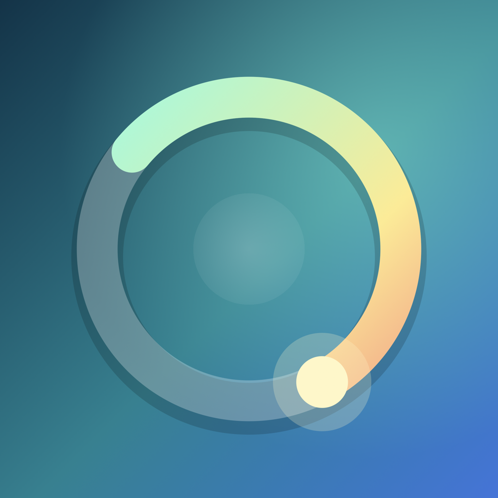
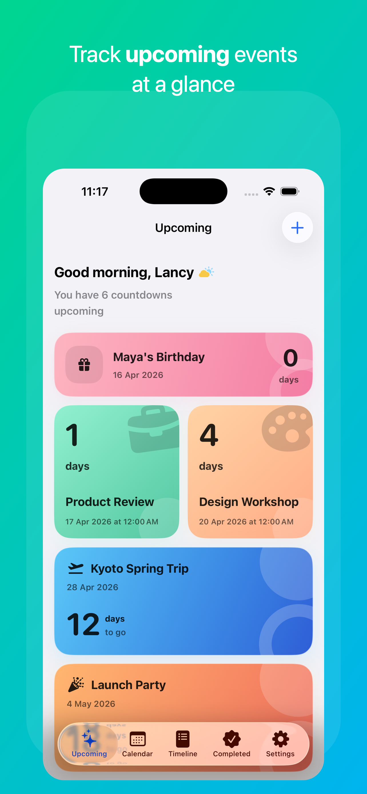
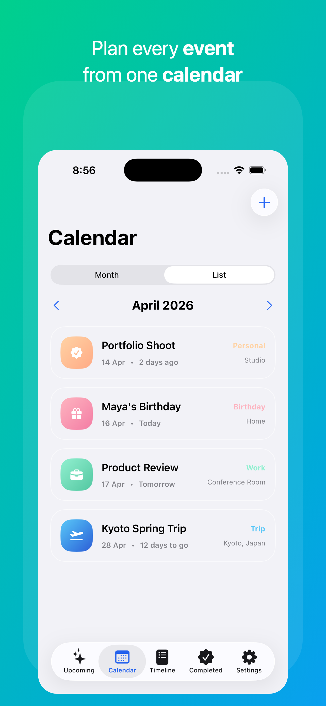
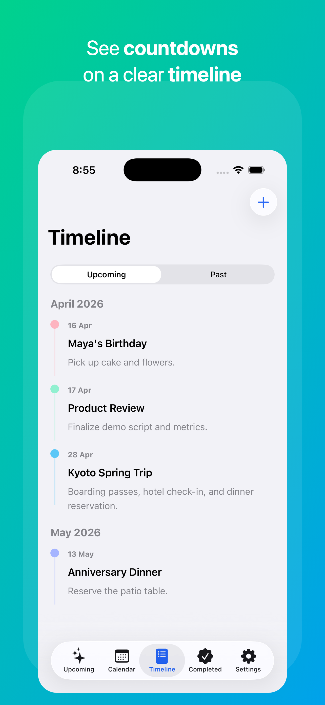
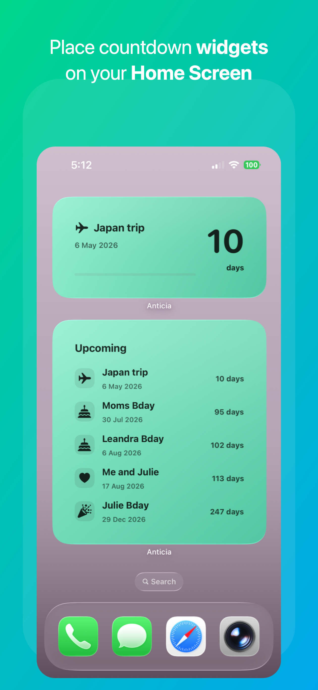
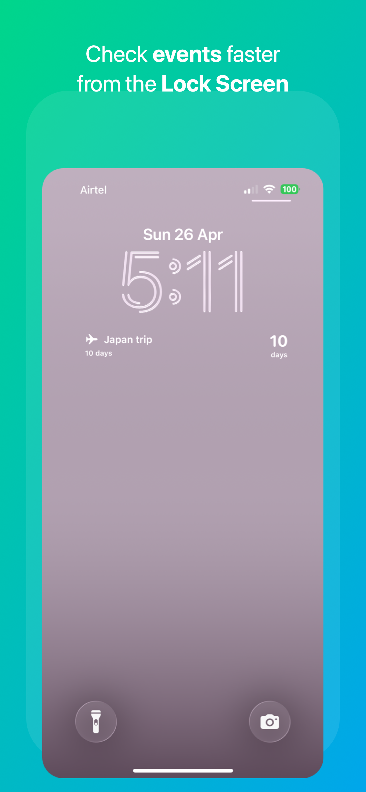

#  Anticia

Anticia is a SwiftUI countdown app for tracking upcoming events, milestones, trips, birthdays, deadlines, and completed countdowns. It uses SwiftData for local persistence, SwiftUI Observation for view models, WidgetKit for Home Screen and Lock Screen widgets, and local notifications to alert users when a countdown starts.

## Get Anticia for iPhone and iPad

<div align="center">
  <a href="https://apps.apple.com/us/app/anticia/id6762339529">
    
  </a>
</div>

Install Anticia from the App Store to track events, trips, birthdays, deadlines, completed countdowns, and glanceable widgets.

## Screenshots

|                                                                                |                                                                                |                                                                                |
| ------------------------------------------------------------------------------ | ------------------------------------------------------------------------------ | ------------------------------------------------------------------------------ |
|  |  |  |

|                                                                                              |                                                                                              |
| -------------------------------------------------------------------------------------------- | -------------------------------------------------------------------------------------------- |
|  |  |

## Features

### Countdown Tracking

- Create, edit, and delete countdowns.
- Support all-day countdowns and date-time countdowns.
- Automatically move countdowns from Upcoming to Completed after their start time has passed.
- Keep all-day countdowns upcoming through the selected date and move them after the day ends.

### Upcoming, Calendar, Timeline, And Completed Views

- Upcoming view with classic, compact, and grid card layouts.
- Calendar view with month and list modes.
- Timeline view for upcoming and past countdowns.
- Completed view for finished or manually completed countdowns.

### Customization

- Categories for trips, birthdays, anniversaries, holidays, work, and personal events.
- Multiple color themes and card styles.
- Symbol picker with searchable SF Symbol options.
- Light, dark, and system appearance settings.

### Notifications

- Local notification scheduled at the countdown start time.
- All-day countdowns notify at the start of the selected day.
- Timed countdowns notify at the selected date and time.
- Pending notifications are rescheduled after edits and canceled after deletes or completion.

### Widgets

- Home Screen widgets in small, medium, and large sizes.
- Lock Screen widgets in circular, rectangular, and inline styles.
- Small and medium widgets show the next upcoming countdown.
- Large widgets show a compact list of upcoming countdowns.
- Widgets use each countdown's selected color theme and deep link back into Anticia.
- Widget data is exported through the shared app group and refreshed after countdown changes.
- Widget timelines refresh when countdown dates pass and at the next daily boundary.

## Tech Stack

- Swift 6
- SwiftUI
- SwiftData
- Observation framework
- WidgetKit
- App Groups
- UserNotifications
- Xcode string catalogs
- iOS 17.0+

The app does not use third-party frameworks.

## Project Structure

```text
Anticia/
├── Anticia/
│   ├── App/
│   ├── Components/
│   ├── Features/
│   ├── Localization/
│   ├── Models/
│   ├── Notifications/
│   ├── Persistence/
│   ├── Resources/
│   ├── Utilities/
│   └── Widgets/
├── AnticiaWidgets/
├── ProjectSupport/
└── Screenshots/
```

## Architecture

Anticia follows a lightweight MVVM structure:

- Views own their view models with `@State`.
- View models use `@Observable`.
- SwiftData queries stay in SwiftUI views through `@Query`.
- View models handle filtering, grouping, summary text, and other derived state.
- Persistence operations are centralized in `PersistenceController`.
- Notification scheduling is handled by `CountdownNotificationScheduler`.
- Widget snapshots are exported by `CountdownWidgetSnapshotStore` into the shared app group.
- Widget timeline and display state are handled by `CountdownWidgetViewModel`.
- Widget rendering lives in the `AnticiaWidgets` extension.

The project has Main Actor default actor isolation enabled.

## Getting Started

### Requirements

- Xcode 16 or later recommended
- iOS 17.0 or later
- macOS with an iOS Simulator runtime installed

### Run The App

1. Open the project in Xcode:

   ```sh
   open Anticia.xcodeproj
   ```

2. Select the `Anticia` scheme.
3. Choose an iPhone simulator or a physical device.
4. Build and run with `Cmd + R`.

## License

Anticia is distributed under a source-available license. Source redistribution and use with or without modification are permitted when the copyright notice and disclaimer are retained.

Binary redistribution is not permitted without specific prior written permission from the copyright holders.

See [LICENSE.md](LICENSE.md) for the full license text.
